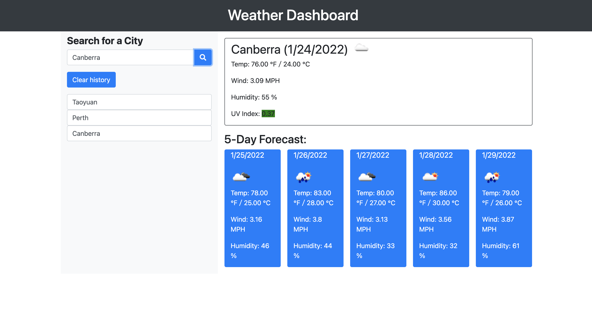

# 🖥 rainorsun
An app forecasting the current and future weather conditions of selected countries

## 📋 Description 

This project is to create an interactive and user friendly (responsive) app of a weather dashboard called "rainorsun" and enabling the public in need of searching for the current and 5 days forecasted weather at any searched city. Weather conditons as key data will be retrieved from two open APIs: Current Weather Data https://openweathermap.org/current and One Call API https://openweathermap.org/api/one-call-api. Searched city with info will be stored at the local storage and four colours are given for the UV index to be hilighted in four colors to indicate the current level of comfortableness of the weather condition. Users can then check what the weather condition is or would become for their current or future locations.

### 👀 Key Features 

+ ⚓ Clear interface for users to seach the current and 5-days forecasted weather condition at any given city.
+ ⚓ Date are updated lively
+ ⚓ Searched items can be stored and reviewed regardless of refreshing the webpage or app
+ ⚓ Clean and polish layout easily for operation
+ ⚓ Easy for updation on dinamical modification of HTML, CSS and javascript

## 📷 Screenshot 

## 🔗 Link

https://chentriangoes.github.io/rainorsun/
